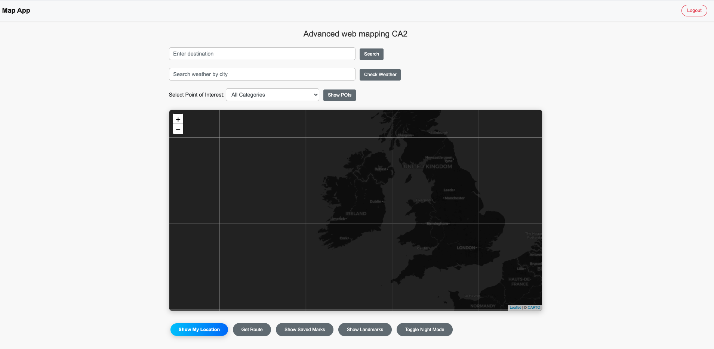
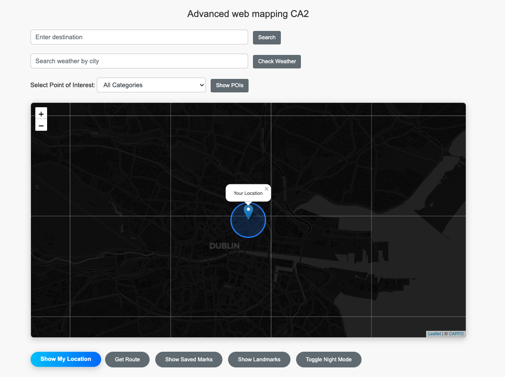
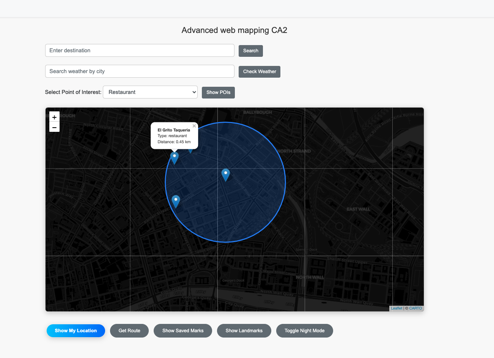
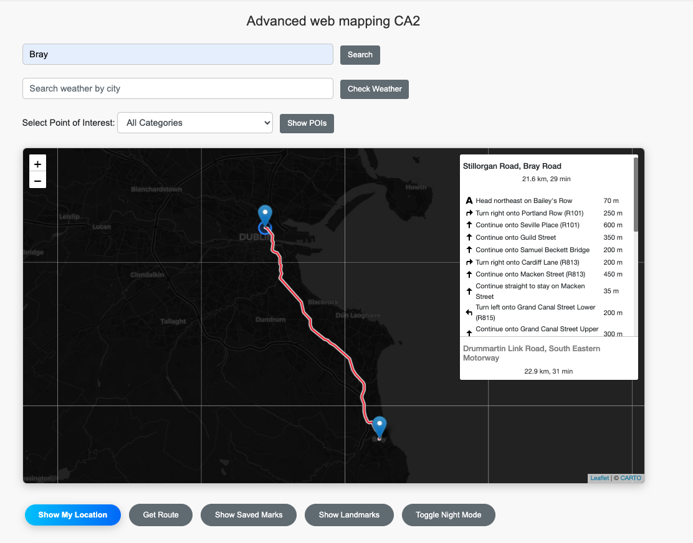
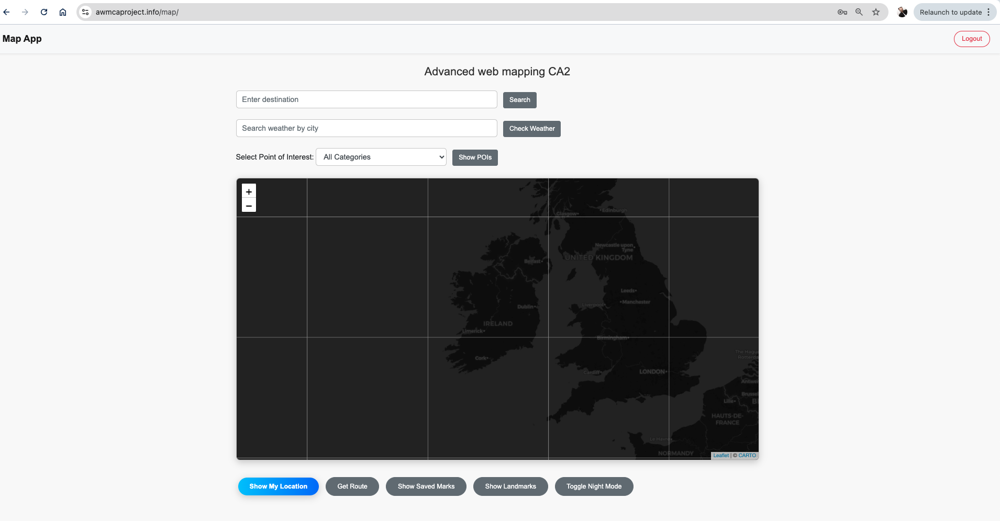
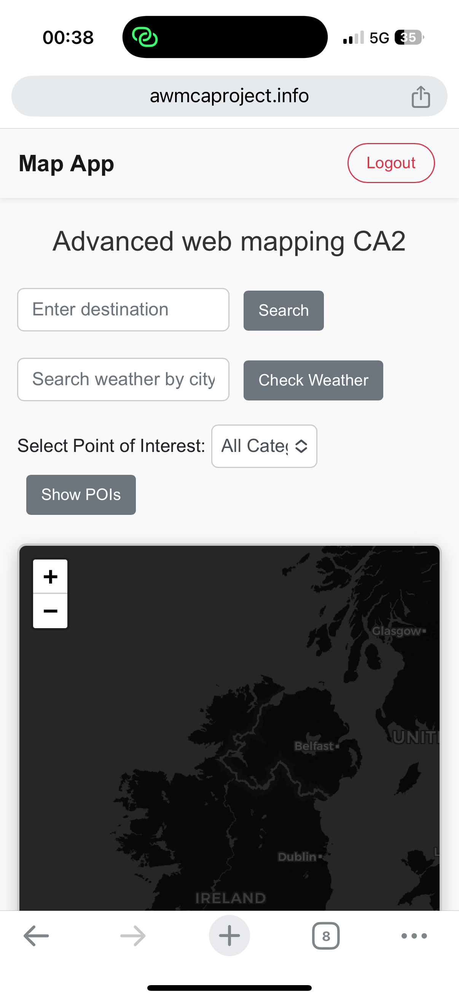
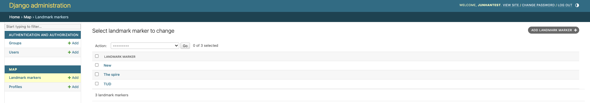

# AWM_CA2

# Hi Dr Raufi Bujar I hope you have a Good Christmas and Happy new Year!

Student Number: D18123630
Student Name: Junhan Dang

Final version project with Advanced Web Mapping CA2
- Domain Link : https://awmcaproject.info/

# Advanced Web Mapping Project (AWM_CA)

This project is an advanced web mapping application that integrates Django, PostGIS, Leaflet.js, and Nginx. The primary purpose of this application is to provide a location-based service with map visualization, allowing users to interact with geospatial data.

## Project Structure

- **Django**: Backend framework for handling requests and serving map data.
- **PostGIS**: PostgreSQL extension for spatial data support.
- **Leaflet.js**: Frontend JavaScript library for interactive maps.
- **Nginx**: Web server and reverse proxy for handling HTTPS and forwarding requests.
- **Certbot**: Tool for obtaining SSL certificates to secure the application.

## Features

- User login and Guest login
- Check the user locations
- Check the Roates
- Check the Weather
- Check the POIs
- Location-based service using PostGIS for spatial data storage.
- Interactive map rendering with Leaflet.js and OpenStreetmap.
- Secure HTTPS access using Let's Encrypt SSL certificate.
- Administrative interface through Django Admin.

## Function Screenshots

### Login

### User current location

### POICheck

### Weather Check

### GetRote

## Serer site Show Docker compose

## BackEND saved Marks

